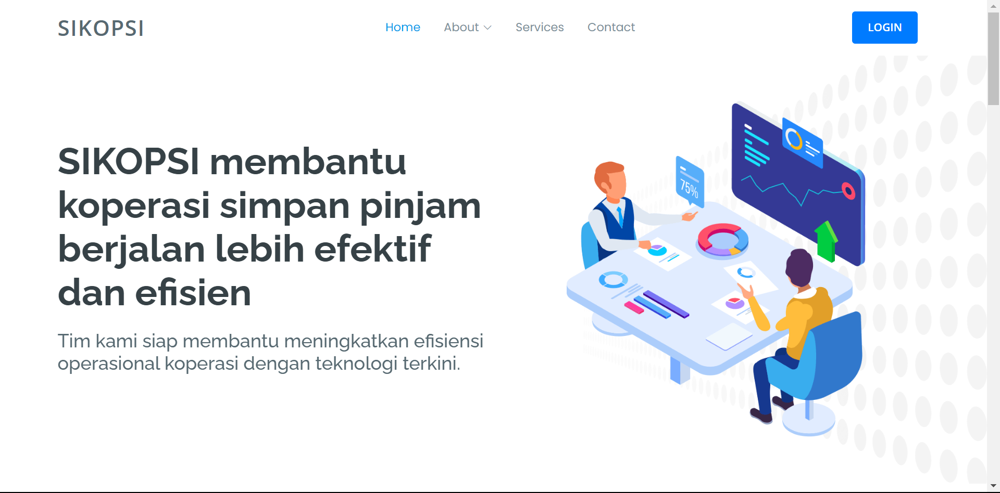
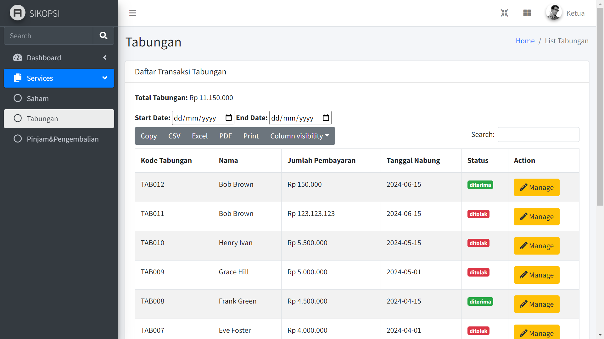

# SIKOPSI - Sistem Informasi Koperasi Sidokerto 💻💸

## 🛠️ Tentang Proyek
**Sistem Informasi Koperasi (SIKOPSI)** adalah sebuah aplikasi berbasis website yang dirancang untuk mengatasi masalah dalam pengelolaan koperasi PKK (Pemberdayaan Kesejahteraan Keluarga) di Desa Sidokerto, RT 04 RW 05. Sistem ini dibuat untuk meningkatkan efisiensi, akurasi, dan transparansi pengelolaan koperasi. Dengan SIKOPSI, berbagai aktivitas koperasi, mulai dari pencatatan transaksi hingga pembuatan laporan, dapat dilakukan secara otomatis dan terstruktur, sehingga meningkatkan kepercayaan anggota koperasi.

## 🎥 Video Panduan Penggunaan
Panduan Penggunaan SIKOPSI: **https://www.youtube.com/watch?v=WmGALN63QuQ**

## 🚀 Fitur Utama
1. **Manajemen Data**: Tambah, Edit, dan Hapus Data Pinjaman, Tabungan, Saham, dan Pengembalian.
2. **Laporan Keuangan**: Menampilkan laporan secara real-time.
3. **Akses Pengguna**:
    - Pengurus: Melihat total data dan visualisasi grafik.
    - Ketua: Mengakses laporan terperinci.
    - Anggota: Melihat data tabungan, pinjaman, dan pengembalian mereka.
4. **Keamanan Data**: Sistem login dan pengelolaan data berbasis role.

## 💻 Teknologi yang Digunakan
- **Backend**: PHP
- **Database**: MySQL (phpMyAdmin)
- **Frontend**: HTML, CSS, JavaScript
- **Server**: Apache Web Server
- **CMS**: Custom Build

## ⚙️ Instalasi
1. Siapkan Apache dan MySQL di XAMPP
    - Jalankan aplikasi XAMPP.
    - Aktifkan Apache dan MySQL dengan menekan tombol "Start" pada kontrol panel XAMPP.
2. Upload Database
    - Buka phpMyAdmin melalui browser dengan mengakses: `http://localhost/phpmyadmin`.
    - Buat database baru dengan nama sikopsi.
    - Pilih database yang telah dibuat, lalu gunakan tab Import untuk mengunggah file `sikopsi.sql`.
3. Upload File Website
    - Salin semua file dalam folder website ke direktori htdocs di dalam folder instalasi XAMPP.
    - Pastikan file berada di subfolder, misalnya: C:/xampp/htdocs/sikopsi.
4. Akses Website
    - Buka website melalui browser dengan alamat: `http://localhost/sikopsi`.
5. Akses Halaman SIKOPSI lebih lanjut
    - Klik login dan dapat mengakses masing-masing role.